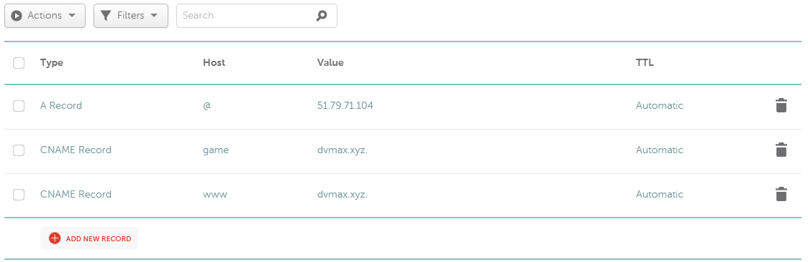

## #2 - Configurer le nom de domaine


## #2 - Crée un site dédié
- [X] Création du répertoire /var/www/dvmax.xyz.
```
mkdir game.dvmax.xyz
```
- [X] Création du vhost "game.dvmax.xyz".
```
sudo  cp /etc/apache2/sites-available/000-default.conf /etc/apache2/sites-available/game.dvmax.xyz.conf
```
- [X] Configurer le vhost
- [X] Activer le vhost
```
sudo  a2ensite game.dvmax.xyz.conf
sudo  systemctl reload apache2
```